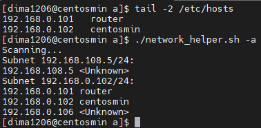

- [Part A - network scan](#part-a---network-scan)
- [Part B - log stats](#part-b---log-stats)
- [Part C - sync](#part-c---sync)

## Part A - network scan

The script is stored in [network_helper.sh](./network_helper.sh).

No options:

Option `-a`:

Note: symbolic names for hosts are fetched with reverse DNS lookup. For simplicity, I added some records to the `/etc/hosts` file. In case if there is a DNS server set up that knows about those hosts, the script will get symbolic names from the DNS server.

Option `-t`:

## Part B - log stats

The script: [log_stats.sh](./log_stats.sh).

To get full statistic, you need to pass the `-a` option. For better screenshots, the script outputs only first three items in a list by default.

Example:

## Part C - sync

The script: [sync.sh](./sync.sh).

Preparing `orig` directory as example:

Note that the `noread` file was created without read permission for the user `dima1206`, under which the cron job will be run.

The cron job that will sync the directories each minute:

Log for the first sync, creating a new file, and the log after second sync:

State of directories after both syncs:

Note that in the log there was an error that says about failed copy of the `noread` file and on the last screenshot the file is missing from the `bac` directory.
