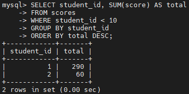
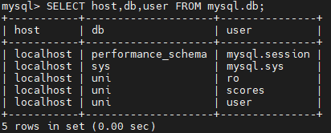

- [Part 1. Local MySQL database](#part-1-local-mysql-database)
- [Part 2. Backup, RDS AWS](#part-2-backup-rds-aws)
  * [Backup](#backup)
  * [RDS AWS](#rds-aws)
- [Part 3. MongoDB](#part-3-mongodb)

## Part 1. Local MySQL database

All queries from this part are also stored in [queries.sql](./queries.sql).

Database schema:

Create database:

Create tables:

Fill in tables:

`SELECT` operator with `WHERE`, `GROUP BY` and `ORDER BY`:

Other queries. `ALTER` and `CREATE` are Data Definition Language queries that change the structure of the database. `UPDATE` is a Data Manipulation Language query that changes data in the database. `GRANT` is a Data Control Language query that grants privileges to database users.

Create users `ro` and `scores`. `ro` user can only read the database data, and `scores	` user can also update students' scores.

Connected as `ro` user:

Connected as `scores` user:

A selection from `db` table of `mysql` database:

## Part 2. Backup, RDS AWS

### Backup

Create [a backup](./uni.sql) of the database:

Drop a table and restore the database:

Check if the `scores` table is fine:

### RDS AWS

A database on RDS AWS:

Create `uni` database on RDS AWS and transfer the database there:

A query similar to the previous part, but in RDS AWS:

[A dump](./uni2.sql) of the database from RDS AWS:

## Part 3. MongoDB

This task is quite easy and can be done in one screenshot:

- `use uni` - switches to the `uni` database;
- `db.createCollection('students')` - creates database `uni` since it wasn't created before; creates a new collection in the `uni` database;
- `show dbs` and `show collections` - shows databases and collections in the current database;
- `db.students.insertMany()` - adds new documents to the `students` collection;
- `db.students.find().pretty()` - shows documents in the `students` collection that match the filter (could also omit the filter to show all documents) and formats output for readability.
