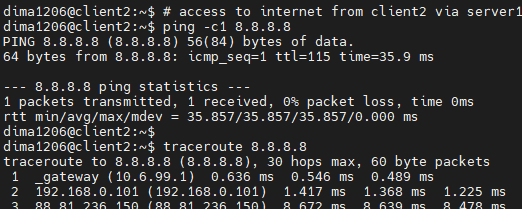
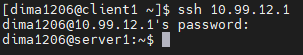
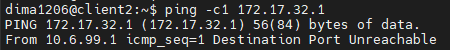

- [Schema, VirtualBox, router](#schema-virtualbox-router)
- [Initial configurations (1-3)](#initial-configurations-1-3)
  * [Server, DHCP](#server-dhcp)
  * [Client1](#client1)
  * [Client2](#client2)
  * [Check connection](#check-connection)
- [Loopback on client1 (4-5)](#loopback-on-client1-4-5)
  * [`lo` interface](#lo-interface)
  * [Routing](#routing)
  * [Summarizing address](#summarizing-address)
- [SSH (6)](#ssh-6)
- [Firewall (7)](#firewall-7)
- [NAT (8)](#nat-8)

## Schema, VirtualBox, router

client1 - CentOS, client2 - Ubuntu, server1 - Ubuntu.

Schema:

VirtualBox network configurations:

Router configuration:

## Initial configurations (1-3)

### Server, DHCP

Interfaces on server1:

Config file for netplan

For DHCP server I installed `isc-dhcp-server` and configured it:

Allow forwarding:

### Client1

Interfaces on client1:

Config files

### Client2

Interfaces on client2:

Config file

### Check connection

From client1 to client2:

From client2 to client1 (using `-I` option to use ICMP echo requests, since default UDP probes are blocked by CentOS's firewall):

Access to Internet from client1:

Access to Internet from client2:

## Loopback on client1 (4-5)

### `lo` interface

Config files

### Routing

Routing table on server1:

Config file

Routing table on client2:

Config file

Check connection from client2 to client1's `lo` interface:

### Summarizing address

Summarizing network address with longest prefix for `172.17.22.1/24` and `172.17.32.1/24` is `172.17.0.0/18`.

New routing table on server1:

Config file

New routing table on client2:

Config file

Check connection from client2 to client1's `lo` interface with new routing tables (both addresses are accessed via server1):

## SSH (6)

I already have configured SSH and using it to access VMs.

Make sure that SSH works

SSH from client1:

SSH from client2:

## Firewall (7)

I directly used `iptables` to configure the rules:

Check if firewall works properly

SSH from client**1**:

SSH from client**2**:

Ping from client2 to 172.17.**22**.1 (client1):

Ping from client2 to 172.17.**32**.1 (client1):

## NAT (8)

Remove custom routing from router:

Add masquerading on server1:

Check connection from client1:

Check connection from client2:

I also installed `iptables-persistent` on server1 to automatically load all the rules at startup from /etc/iptables/[rules.v4](./rules.v4).