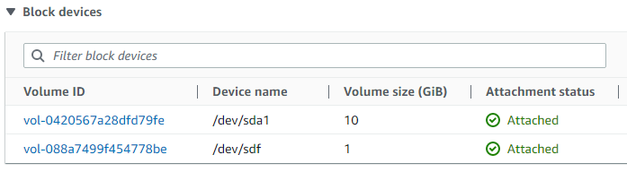
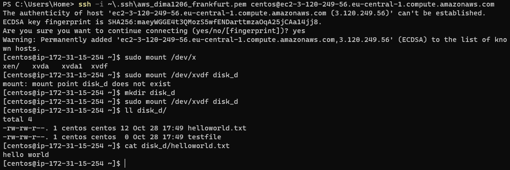

## Static S3 site

The site is located at https://aws.dimalysenko.pp.ua and contains list of tutorials and labs that I've completed.

## EC2 instances and EBS

Create EC2 instance:

Note: while creating the instance, I configured security group to allow SSH from my IP address.

Connect to the EC2 instance:

Snapshot of the root EBS volume of the EC2 instance:

Attached second EBS volume to the EC2 instance:

Create file system on the second volume, mount it, create some file and unmount:

Terminate the instance:

Go back to the snapshot and create AMI image from it:

Launch new instance from the created AMI:

Attach second volume from previous instance:

Connect to the new instance, mount the second volume and check files that were created before:

Terminate all EC2 instances:

Note: I've also removed other used resources to avoid billing (AMI image, EBS volume, EBS snapshot).
