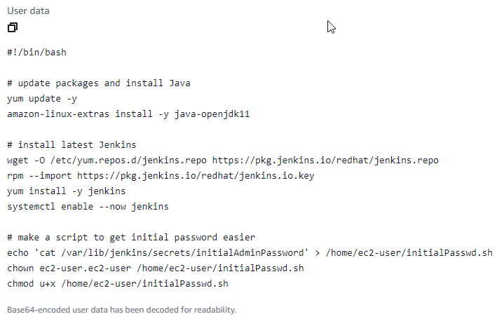
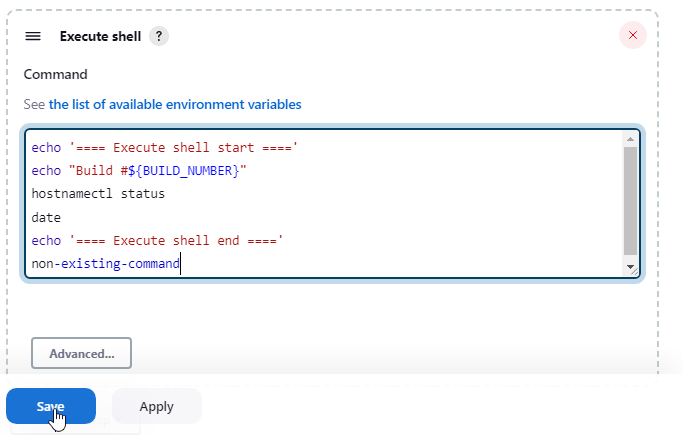
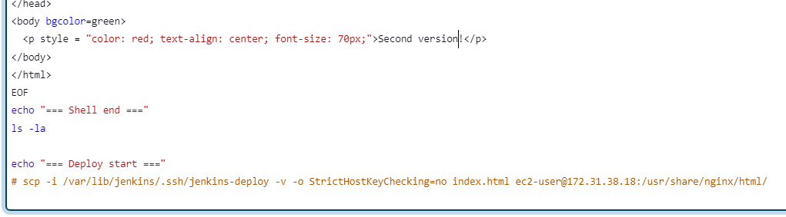
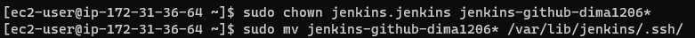
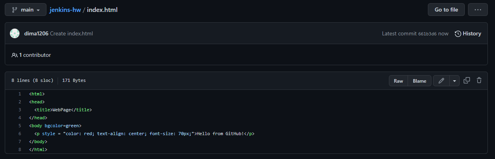
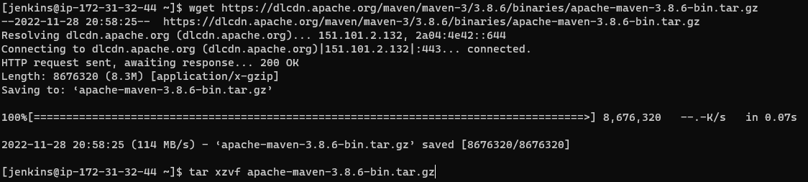

- [EC2 instances](#ec2-instances)
- [Lecture 1](#lecture-1)
  * [Install Jenkins](#install-jenkins)
  * [Configure Jenkins](#configure-jenkins)
  * [Create a simple job (+ green balls plugin)](#create-a-simple-job--green-balls-plugin)
- [Lecture 2](#lecture-2)
  * [Jenkins data in file system](#jenkins-data-in-file-system)
  * [Deploy job (freestyle project)](#deploy-job-freestyle-project)
    + [Initial job setup](#initial-job-setup)
    + [Use scp to transfer artifact](#use-scp-to-transfer-artifact)
    + [Publish Over SSH plugin](#publish-over-ssh-plugin)
    + [Pull HTML page from GitHub](#pull-html-page-from-github)
    + [Poll SCM](#poll-scm)
    + [GitHub webhook](#github-webhook)
- [Lecture 3](#lecture-3)
  * [Jenkins agents](#jenkins-agents)
    + [Simple agent](#simple-agent)
    + [Deploy directly on agent](#deploy-directly-on-agent)
  * [Jenkins CLI](#jenkins-cli)
  * [Pipeline](#pipeline)
    + [Initial pipeline setup](#initial-pipeline-setup)
    + [Pipeline script from GitHub](#pipeline-script-from-github)
    + [Maven](#maven)

## EC2 instances

| Name | Public IP | Private IP | Description |
| --- | --- | --- | --- |
| jenkins-controller-hw | 3.72.106.235 | 172.31.36.64 | Jenkins controller 2.379 |
| jenkins-node0 | 54.93.251.219 | 172.31.32.44 | An agent for Jenkins |
| dev-web-server | 52.59.56.225 | 172.31.38.18 | EC2 instance for deploy |

## Lecture 1

### Install Jenkins

I already have a template on AWS ...

... with [user data](./userdata-controller.sh) that installs Jenkins:

### Configure Jenkins

After the `jenkins-controller-hw` instance was launched from template and the user data script was finished, I opened Jenkins Web-interface via public IP and pasted initial admin password:

I installed recommended plugins:

Created first user:

Kept default Jenkins URL with public IP (Note: I'll use private IP and `localhost` as well down below):

Freshly installed Jenkins:

Installing a plugin after Jenkins installation:

### Create a simple job (+ green balls plugin)

Create a freestyle project:

Add a build step that executes shell:

Successful build:

Edit shell script that will cause an error:

Failed build:

Installing the Green Balls plugin:

Note: Jenkins recently changed icons and that broke the plugin. [Related issue](https://issues.jenkins.io/browse/JENKINS-66339).

Fix the error in the script:

History of builds:

## Lecture 2

### Jenkins data in file system

Directory with Jenkins data:

Directory with builds for the `first-job` job:

Configuring log rotation to discard old builds:

Directory with builds for the `first-job` job after limiting number of builds to keep:

### Deploy job (freestyle project)

#### Initial job setup

Create a job:

Add a step to create an HTML page:

Check that it works:

#### Use scp to transfer artifact

Create SSH keys on `jenkins-controller-hw` that will be used for deploying, copy public key:

Add the public key to authorized keys on `dev-web-server`:

Change permissions on `dev-web-server` so `ec2-user` could write to the `/usr/share/nginx/html/` directory:

Properly save generated keys on `jenkins-controller-hw` so `jenkins` user could use them:

Add `scp` command to the script:

Test that it works:

#### Publish Over SSH plugin

Install the plugin:

Generate another key for the plugin (Note: the plugin doesn't support the new SSH key format, [related issue](https://github.com/jenkinsci/publish-over-ssh-plugin/issues/89)):

Properly save the keys and copy the public key:

Add it to the authorized keys on `dev-web-server`:

Configure the plugin to use the keys:

Remove `scp` command from the script and change HTML content:

Use 'Publish Over SSH' plugin in post-build actions:

Check that it works:

#### Pull HTML page from GitHub

Generate new keys to connect to GitHub:

Properly store the keys:

Copy the public key:

Add the public key to GitHub:

Add GitHub to the list of known hosts:

Check that saved fingerprints are authentic using [official GitHub fingerprints list](https://docs.github.com/en/authentication/keeping-your-account-and-data-secure/githubs-ssh-key-fingerprints):

Create `index.html` file on GitHub:

Start configuring SCM for the job:

Copy private key for GitHub:

Configure credentials for GitHub:

Chose the credentials that were just configured:

Remove creating HTML from the script:

Leave post-build action as it was:

Check if it works:

#### Poll SCM

Enable 'Poll SCM' option and configure it to poll every other minute:

Change content on GitHub:

Check if it works:

#### GitHub webhook

Disable Poll SCM and enable GitHub hook:

Configure repository on GitHub to send notifications to the `jenkins-controller-hw`:

Edit content on GitHub:

Check if it works:

## Lecture 3

### Jenkins agents

#### Simple agent

Install plugins to work with agents over SSH: 

Add a new node:

Create new SSH keys on `jenkins-controller-hw`:

Properly store the keys:

Copy the public key:

On `jenkins-node0` create the `jenkins` user and save the public key to the list of authorized keys:

On `jenkins-controller-hw` save fingerprints of `jenkins-node0` to the list of known hosts:

Copy the private key:

And add it to credentials in Jenkins:

Disable executors on `jenkins-controller-hw`:

List of executors now doesn't include the build-in node:

Save fingerprint of GitHub on `jenkins-node0`:

Create a new job:

Use only nodes with the `linux` label:

Check that it worked:

#### Deploy directly on agent

Copy private SSH key for deploying that was created in the [Use scp to transfer artifact](#use-scp-to-transfer-artifact) section:

Add it to Jenkins credentials:

Use it while adding `dev-web-server` as an agent:

List of executors that includes `dev-web-server`:

Configure the job from the [Deploy job (freestyle project)](#deploy-job-freestyle-project) section to run only on agents with the `nginx` label:

Edit the script to copy files from SCM to the `/usr/share/nginx/html/` directory:

Edit the content on GitHub:

Check that it works:

### Jenkins CLI

Download `jenkins-cli.jar` from Jenkins controller:

Check that it works:

Generate API token to use instead of the password:

Check that the token works:

Export the token and username to the environment variables and omit the `-auth` option from the command:

### Pipeline

#### Initial pipeline setup

Create a new pipeline:

Create a simple pipeline script:

Check that it works:

#### Pipeline script from GitHub

Copy the script to GitHub:

Configure the pipeline to pull the script from GitHub:

Check that it works:

#### Maven

Install Maven on `jenkins-node0`:

Configure maven tool location on `jenkins-node0`:

Add `mvn` label to the node:

Generate a simple project with Maven:

Add the project to GitHub:

Create a new job:

Configure the job to pull source code from GitHub:

Configure the job to run Maven:

Restrict the job to run only on nodes with Maven installed:

Check that it works:

