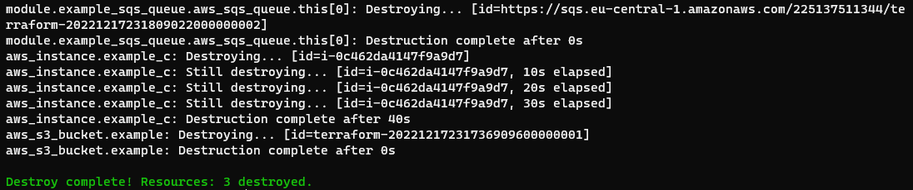

- [Lecture 1](#lecture-1)
  * [Intro](#intro)
- [Lecture 2](#lecture-2)
  * [Implicit dependencies](#implicit-dependencies)
  * [Explicit dependencies](#explicit-dependencies)
  * [Variables and outputs](#variables-and-outputs)
    + [Variables](#variables)
    + [Outputs](#outputs)
    + [Outputs extra task](#outputs-extra-task)
  * [Modules](#modules)
    + [Modules main task](#modules-main-task)
    + [Modules extra](#modules-extra)

## Lecture 1

### Intro

Install Terraform ([script](./install_terraform.sh)):

Confirm installation:

Configure AWS profile using AWS CLI:

A [simple example](./01_intro/TF_intro_01.tf) with two EC2 instances:

`terraform init`:

`terraform plan`:

`terraform apply`:

The `terraform.tfstate` file is stored locally in the same folder:

`terraform destroy`:

## Lecture 2

### Implicit dependencies

[main.tf](./02_implicit_dep/main.tf):

Resource `ip` implicitly depends on resource `example_a` because the instance id will be known only after the instance is created.

`terraform apply` and created resources in the AWS console:

Elastic IP started creating only after `example_a` instance was created.

`terraform destroy`:

`example_a` instance started destroying only after the elastic IP was destroyed.

### Explicit dependencies

[main.tf](./03_explicit_dep/main.tf):

`depends_on` explicitly tells Terraform to create the resource only after the specified resources were created. In this case `example_c` depends on `example`, and `example_sqs_queue` depends on both `example` and `example_c`. It means that those 3 resources will be created/destroyed only sequentially.

`terraform init` to make sure that needed plugins and modules are installed:

`terraform apply`:

All 3 resources were created sequentially and not in parallel.

`terraform destroy`:

All 3 resource were also destroyed sequentially and not in parallel.

### Variables and outputs

Files for this task are located in the [04_vars_output](./04_vars_output) directory.

#### Variables

[main.tf](./04_vars_output/main.tf) references `instance_name` variable:

[variables.tf](./04_vars_output/variables.tf) is describing the variable with default value of `ExampleInstance`:

`terraform apply` tells that an EC2 instance will be created with the name `ExampleInstance`:

`terraform apply` actually created the instance:

`terraform apply -var 'instance_name=YetAnotherName'` shows that tags will be edited for the instance changing its name to `YetAnotherName`

Actually applied changes:

#### Outputs

[outputs.tf](./04_vars_output/outputs.tf) describes outputs:

`terraform apply` shows that there are changes to outputs. After applying, it shows the outputs:

Can also get outputs with `terraform output`:

Destroy recources to avoid billing:

#### Outputs extra task

Extra task was to see what happens to outputs when you manually change resources in the AWS console.

`terraform apply` to create the resources again:

`terraform output` shows the outputs:

Stop the instance manually:

Try `terraform output` again and see that public IP is still shown even though it was removed when the instance was stopped:

Check the `terraform.tfstate` file and see that the output values are still stored in there:

`terraform plan` detected external changes to the public IP and tells that applying now would remove the public IP from the current state:

Since the instance was only stopped and still exists, it matches the described infrastructure, so `terraform plan` didn't show restarting or recreating the instance.

Actually applying with show empty string for the public IP:

Manually terminate/destroy the instance:

Now `now terraform plan` shows that the instance was deleted outside of the Terraform and it will recreate the instance:

### Modules

#### Modules main task

The task was to just try out the [existing code](https://github.com/hashicorp/learn-terraform-modules/blob/tags/ec2-instances) that uses existing modules.

Cloning the code with `git clone --depth 1 --branch tags/ec2-instances https://github.com/hashicorp/learn-terraform-modules.git`:

List of cloned files:

[main.tf](https://github.com/hashicorp/learn-terraform-modules/blob/tags/ec2-instances/main.tf) file:

I edited the file to use the profile that I configured on the system:

`terraform plan` shows that 22 resources will be created with just few lines of code that use 2 modules:

Those resources include:
- 2 EC2 instances
- 2 elastic IPs (1 for each NAT gateway)
- 1 Internet gateway
- 2 NAT gateways
- 3 routes (1 for each gateway)
- 3 route tables (1 public and 2 private)
- 4 route table associations (1 for each subnet)
- 4 subnets (2 public and 2 private)
- 1 VPC

#### Modules extra

To get better understanding of modules in Terraform, I also went trough [this guide](https://developer.hashicorp.com/terraform/tutorials/modules/module-create) that explains local modules.

Cloning the example code:

List of files:

`main.tf` in the module describes 4 resources - 1 S3 bucket and 3 related resources to the bucket (ACL, policy and website configuration):

`variables.tf` in the module describe parameters for the module:

`output.tf` describes values that can be accessed from outside of the module:

I edited root files a little bit.

In `main.tf` I removed other modules, specified AWS CLI profile and a different bucket name:

Note: When using module, `bucket_name` and `tags` are specified. Those are the variables that were specified in the module.

I also removed corresponding outputs in the `output.tf` file:

Note: Root file references the outputs from the module that were described earlier.

I also removed `variables.tf` since it didn't contain anything related to the S3 bucket:

`terraform init` initializes modules along with other things:

`terraform plan`:

`terraform apply`:

Uploading files to the bucket:

Content of the `index.html`:

Opening the bucket in a browser:

Note: SSL certificate is invalid because the bucket has dots in its name and it makes multi-level subdomain that the certificate doesn't cover.

I tried to destroy the bucket with objects in it to see how Terraform will behave in this case. It destroyed 3 other resources, but not the bucket itself:

Empty the bucket:

`terraform destroy` after emptying the bucket:

