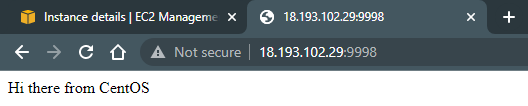
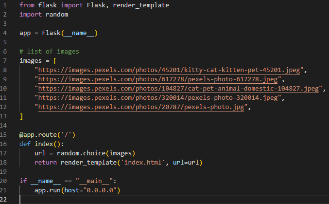

- [Lecture 1](#lecture-1)
  * [Intro with Ubuntu container](#intro-with-ubuntu-container)
  * [Intro with CentOS container](#intro-with-centos-container)
  * [Pruning](#pruning)
- [Lecture 2](#lecture-2)
  * [Flask app](#flask-app)
  * [Dockerhub](#dockerhub)
  * [Frequently used Docker commands](#frequently-used-docker-commands)
    + [Existing images and containers](#existing-images-and-containers)
    + [Searching and pulling images, running containers](#searching-and-pulling-images--running-containers)
- [Lecture 3](#lecture-3)
  * [Docker Compose](#docker-compose)

## Lecture 1

### Intro with Ubuntu container

[Script](./userdata-docker-ubuntu.sh) to install Docker on Ubuntu:

I've also made a similar script for Amazon Linux: [userdata-docker-amazon-linux.sh](./userdata-docker-amazon-linux.sh)

Make sure that Docker is installed:

Run a simple container to see that Docker works fine:

[Dockerfile](./01_intro_ubuntu/Dockerfile) with few changes:

What was changed in the Dockerfile: using latest Ubuntu version (`22.10` instead of `20.04`), using the new name for the timezone (`Europe/Kyiv` instead of `Europe/Kiev`), added `tzdata` package to actually change the timezone.

Build the image:

Move `Dockerfile` to a subdirectory `dockerfiles` and build again using cache:

List of images saved locally:

Running a container from the image, listing all containers in the system, making sure that the port is open:

Checking apache server in the container using browser and public IP:

Command from the lecture that didn't work:

The lecturer said that the error appeared because there is no container with such name. In fact, the command references an image and tries to create a new container. The error is caused by wrong parameter at the end. It expects a command to run, but `.` isn't a valid command.

Example of the right command:

On the screenshot you can see that time is different for container and host.

Stopping the container:

### Intro with CentOS container

[Dockerfile](./02_intro_centos/Dockerfile):

Building an image:

Running container based on the image:

Making sure the web server works using public IP and browser:

The container in the list of running containers:

### Pruning

Pruning most of the docker data:

Docker warns about what data will be removed:

By default it removes stopped containers, unused networks, dangling images ([untagged images](https://docs.docker.com/engine/reference/commandline/images/#show-untagged-images-dangling)) and dangling build cache.

With the `-a` option it also removes tagged images that don't have associated containers and all build cache.

## Lecture 2

### Flask app

The project files are located [here](./03_flask/flask-app). Most changes are fixes and upgrades.

`index.html` (added missing `img` tag, added CSS style for `img` to properly display images):

`app.py` (no important changes):

`Dockerfile` (newer versions of Alpine Linux, Python and pip):

`requirements.txt` (newer version of Flask):

Uploading the project to EC2 instance with installed Docker:

Building the image:

Running container:

Checking it via public IP:

Logs are printed to the terminal:

### Dockerhub

Created access token:

Logged in:

Add a name that references repository and push the image:

The image on Dockerhub:

### Frequently used Docker commands

#### Existing images and containers

List running containers and all containers:

Stop all containers:

Remove container:

Remove all images that aren't used by any container:

Remove all images even if they're used by a container:

#### Searching and pulling images, running containers

Searching for tomcat images:

Pulling tomcat images:

Searching nginx images:

Pulling nginx image:

Running tomcat container with attached terminal that is connected to my stdin:

Exit with Ctrl+C (stops container):

Running nginx container in the same way:

Exiting with Ctrl+C:

Running nginx server in detached mode (my terminal is not connected to the container terminal), the container keeps running:

## Lecture 3

### Docker Compose

[docker-compose.yml](./05_compose/my_wordpress/docker-compose.yml):

Start containers and do other things that are required (pulling, building): 

Running the command again only outputs that containers are already running:

List of running containers using `docker ps`:

List of running containers using `docker compose ps`:

Setting up the WordPress site:

After creating an admin account, I successfully logged in, so database is working:

Inspect the volume that was created with Docker Compose:

Create, inspect and remove a volume without Docker Compose:

